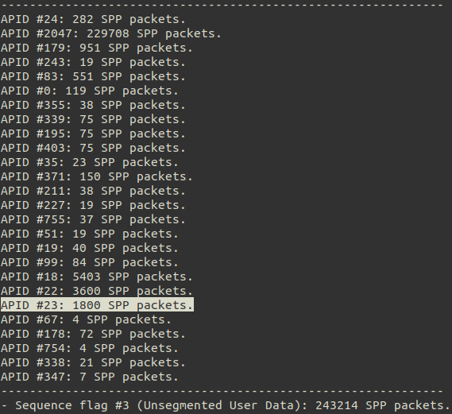

# A Sign in Space
This repository contains my custom solution, coded from scratch, for the demodulation and analysis of the data transmitted by ExoMars TGO for "[A Sign In Space](https://asignin.space)" event.

I believe that learning is a continuous (and never-ending) journey, and I hope that the solution provided in this repository serves as a valuable resource for anyone who is eager to delve into the fascinating world of interplanetary signal decoding. My aim is to share my knowledge and experiences so that others can learn and grow as much as I did by doing this. 

Throughout the process, it's important to note that I expedited certain aspects of the reverse engineering process by leveraging the collective knowledge and insights shared by fellow enthusiasts in the [Discord community](https://discord.com/invite/2upxzmZkqY) dedicated to this project. By standing on the shoulders of those who have come before us, we can accelerate our understanding and push the boundaries of what is possible. I encourage everyone to embrace the collaborative spirit, actively engage with others, and together, let's embark on an exciting learning journey.

# GNU Radio Flowgraph
The **GNU Radio** [flowgraph](Demodulation.grc) provides you with the [blocks](resources/Demodulation.pdf) to visualize and guess the key parameters about the received signal and finishes with the extraction of the **_CCSDS TM Space Data Link Protocol Frames_**. These are saved in [final_decoded_frames.u8](final_decoded_frames.u8) binary file (adjust the flowgraph sink file to your preferences).

## Python Code Snippets

1. You may research the Python code snippet [Packet_Analysis.py](Analysis/Packet_Analysis.py) to check how to:
 - [x] Unpack and classify the **_CCSDS TM Space Data Link Protocol Frames_** into different _Virtual Channels_.

 
- [x] Unpack and classify **_CCSDS Space Packet Protocol_** packets inside the CCSDS frames, into different _Application Process Identifiers_ (APIDs).

- [x] Extract the information of a target _APID_. In our case, `APID #23`, with 1800 Space Packets. Click [here](https://youtu.be/zgQq36IR-Lk?t=2408) to understand why we took this shortcut.
- [x]  Extract the packet inside the Space Packets. In our case Packet Utilization Standard (PUS) Packets. Check the file [Data_Analysis.py](Analysis/Data_reverse_engineering) to see the structure of the PUS Packets, and how it can be understood. The final data is saved to [raw_data.bin](Analysis/raw_data.bin)

2. You may use the Python code snippet [Data_Analysis.py](Analysis/Data_Analysis.py) to:

- [x] Explore the contents of *The Message*, taking [raw_data.bin](Analysis/raw_data.bin) as an input.
- [x] The python code shows the header and trailer bit stream, computes autocorrelation of the bitstream, and plots an image whose number of columns matches the index of maximum autocorrelation. This is one of the many (*infinite?*) ways to understand the message but was one of the most popular and accepted ones in the [Discord community](https://discord.com/invite/2upxzmZkqY).
      

- [ ] Feel free to play with it and find new interpretations of the bitstream!

## Prerequisites

- GNU Radio 3.8 & Python 3.8.

- The signal. I used the recording made at *Green Bank Telescope* (GBT).  You can download it [here](https://zenodo.org/record/7982936#.ZHXl_3ZBy3B) (*A_Sign_in_Space-GBT.sigmf-data* - 4.5 GB). If you want it to work seamlessly with the provided flowgraph, place the recording in the [recording](recording/) folder.

## Useful References to Follow the Reverse Engineering Process
1. [CCSDS - SFCG Efficient Modulation Methods Study - A Comparison of Modulation Schemes](resources/CCSDS-SFCG_Efficient_Modulation_Methods_Study-A_Comparison_of_Modulation_Schemes.pdf)
2. [CCSDS - TM Synchronization and Channel Coding (Blue Book)](resources/CCSDS_TM_Synchronization_and_Channel_Coding.pdf)
3. [CCSDS - TM Space Data Link Protocol (Blue Book)](resources/CCSDS_TM_Space_Data_Link_Protocol.pdf)
4. [CCSDS - Space Packet Protocol (Blue Book)](resources/CCSDS_Space_Packet_Protocol.pdf)
5. [ECSS - Ground Systems and Operations - Telemetry and Telecommand Packet Utilization](resources/ECSS_Ground_Systems_and_Operations-Telemetry_and_Telecommand_Packet_Utilization.pdf)

## Acknowledgments

-   This solution was inspired by the work of [Daniel Estévez](https://github.com/daniestevez/grcon2020-workshop/) in the field of interplanetary signal decoding.
- If you're interested in exploring an alternative approach to decoding this *Message*, I recommend visiting [BatchDrake's GitHub repository ](https://github.com/BatchDrake/ASignInSpace). It provides an implementation written in C language. You'll gain insights into an alternative methodology that doesn't rely on GNU Radio.
- As I already mentioned, a lot of shortcuts (e.g., extracting data from only one specific *Virtual Channel* or *APID*) were taken during the reverse engineering process for my solution. This was possible to the [A Sign in Space's Discord community](https://discord.com/invite/2upxzmZkqY). For an in-depth understanding of how was it to approach the decoding blindly, I invite you to join the Discord community. 

## Contact Me

Feel free to get in touch with me on Twitter. I welcome any questions, feedback, or opportunities for collaboration!

🐦 **Twitter:** [@gaoterop](https://twitter.com/gaoterop)

I look forward to connecting with you!
